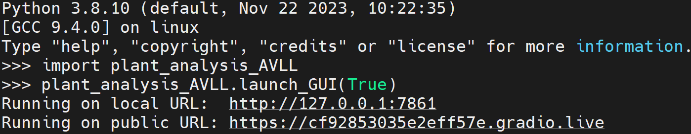

### Installation from PyPI

* Python is needed to launch the GUI. Install the library using PyPI with the command  \
`pip install -i https://test.pypi.org/simple/ plant-analysis-AVLL`

### Launch GUI

After successfully installing the library, follow these commands in Python command line to launch the GUI interface

* Import the library by `import plant_analysis_AVLL`

* Launch the GUI `plant_analysis_AVLL.launch_GUI()`. Putting the argument of True in the launch function will generate a publicly sharable link.

After running the command, GUI will be running in the local. Click or Paste the link generated from the above command in your browser

To access the GUI from the host, use the local link. Follow the public link to access the GUI from outside the host.

Check out [usage guide](usage.md) to get started with GUI
