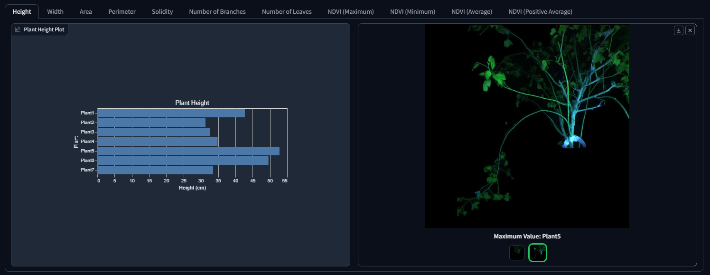
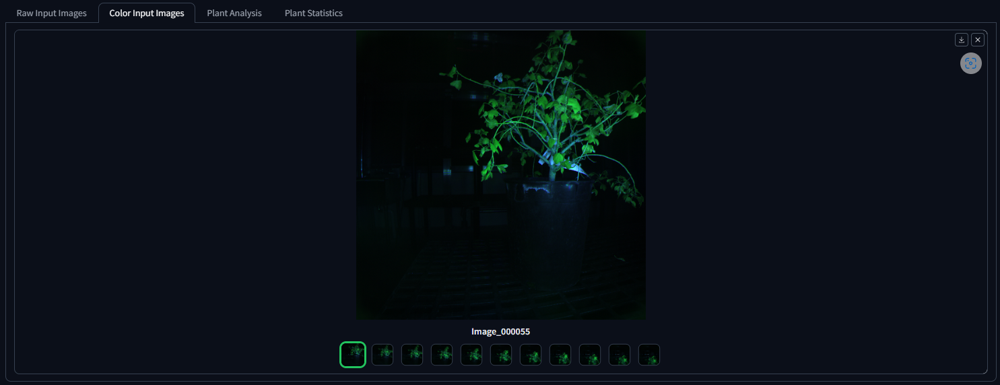
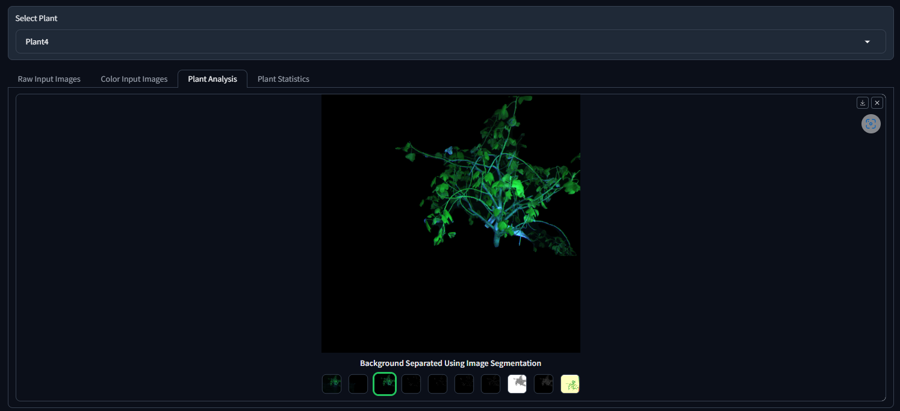
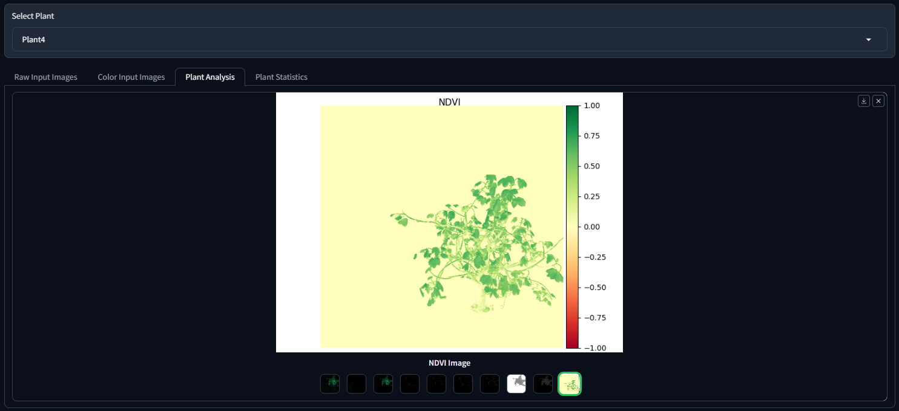
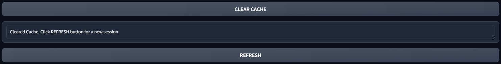

## Welcome to the Usage guide to the Plant Phenotyping GUI

Check out the installation guide at [installation](installation.md)

Upon launching the GUI, click the generated link or paste the link into your browser. The page will be as below:

### Select Service Type and Submit Request

From the **Select Service** dropdown, you can choose two options.

* *Single Plant Analysis* will analyze images of a single plant and generate features and statistics of that plant
* *Multi Plant Analysis* will analyze images of multiple plants at once and give a comparison of plant statistics across all plants. This option is chosen by default if not selected.

After selecting the service type, you will be prompted to enter the folder path to input images. The expected structure of the input folder is as below

Here, raw images of each plant are separated into different folders. Image names of a plant in its folder should be named in sorted order so that the order can be used to stitch the images later to generate a single stitched image per plant.

If the selected service type is *Single Plant Analysis*, enter the folder path of one plant that contains its images. For *Multi Plant Analysis*, enter the path to the directory containing multiple plant directories as shown above.

After entering the folder path, you can click **Submit Input Folder Path** and you will be asked to choose some options to display additional images in the analysis.

*Show Raw Images* will display the input raw images. *Show Color Images* will display the input images after converting them to color. These options can be used for inspection if necessary.

Upon choosing options, click **Submit** which submits the request to the host server. A textbox will be displayed saying the number of plants being analyzed.

### Plant Analysis

After the host server analyzes the Plants, It will display the summary of plant statistics

In the above screen capture, we can see the summary statistics plot for each statistic in a different tab. Besides the plot, we have a gallery showing the plant images that have minimum and maximum values of the statistic. For plant height, check the plant image that got the maximum value below

From the **Select Plant** dropdown, you can select the plant name to show plant analysis. Plant analysis has 2 tabs by default. If the *Show Raw Images* or *Show Color Images* options are chosen before, additional tabs will be displayed accordingly. In this case, as we chose both options, 4 tabs are displayed.

* *Raw Input Images* displays the input images to the pipeline

* *Color Images* displays images after converting to color

* *Plant Analysis* contains the extracted plant features

We have recently added the NDVI image of the plant. Checkout the NDVI in the plant analysis tab

* *Plant Statistics* shows the estimated plant statistics

Supported plant statistics are:

* Height
* Width
* Area
* Perimeter
* Solidity
* Number of Branches
* Number of leaves
* NDVI (Maximum)
* NDVI (Minimum)
* NDVI (Average)
* NDVI (Positive Average)

### Save Result

Enter the folder path to which you want the results to be saved and click **Save Results**

You will be prompted with a text box acknowledging that results are saved.

### Clear Cache and Refresh

To restart and make a new request again, click **Clear Cache**. As the intermediate analysis result is saved in the host server, clearing the cache before submitting a new request is recommended. This will help the system to optimize the memory use. After clearing the cache, click **Refresh** to make a new request.
